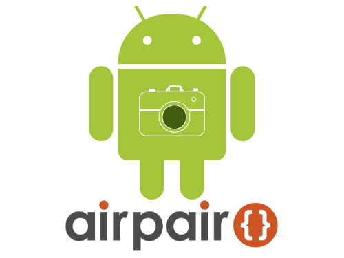

<h1 align="center">ULTIMATE ANDROID CAMERA GUIDE</h1>
Presented by www.AirPair.com
by Rex St. John
www.rexstjohn.com
twitter: @rexstjohn

The official "Ultimate Android Camera Guide" source repo.

Includes examples on how to..

<ul>
<li>Use android's native camera to capture an image</li>
<li>Use android's external camera to capture an image</li>
<li>Load images from the gallery into a grid view</li>
<li>Use Androids gallery to "Select" a single image</li>
<li>Display images in a horizontal list form</li>
</ul>

INSTRUCTIONS

Download / clone. Open in Android Studio. Run. The end.

ATTRIBUTION

This project makes use of source code snippets provided by Google's Android development portal and TwoWayView by Lucas Rocha: https://github.com/lucasr/twoway-view. Certain code portions are derived partially from results found on StackOverflow during research:

<ul>
<li><a href="http://stackoverflow.com/questions/4484158/list-all-camera-images-in-android">List all camera images in Android</a></li>
</ul>

LICENSE

Copyright (c) 2014 Rex St John, @rexstjohn

Permission is hereby granted, free of charge, to any person obtaining a copy
of this software and associated documentation files (the "Software"), to deal
in the Software without restriction, including without limitation the rights
to use, copy, modify, merge, publish, distribute, sublicense, and/or sell
copies of the Software, and to permit persons to whom the Software is
furnished to do so, subject to the following conditions:

The above copyright notice and this permission notice shall be included in
all copies or substantial portions of the Software.

THE SOFTWARE IS PROVIDED "AS IS", WITHOUT WARRANTY OF ANY KIND, EXPRESS OR
IMPLIED, INCLUDING BUT NOT LIMITED TO THE WARRANTIES OF MERCHANTABILITY,
FITNESS FOR A PARTICULAR PURPOSE AND NONINFRINGEMENT. IN NO EVENT SHALL THE
AUTHORS OR COPYRIGHT HOLDERS BE LIABLE FOR ANY CLAIM, DAMAGES OR OTHER
LIABILITY, WHETHER IN AN ACTION OF CONTRACT, TORT OR OTHERWISE, ARISING FROM,
OUT OF OR IN CONNECTION WITH THE SOFTWARE OR THE USE OR OTHER DEALINGS IN
THE SOFTWARE.
